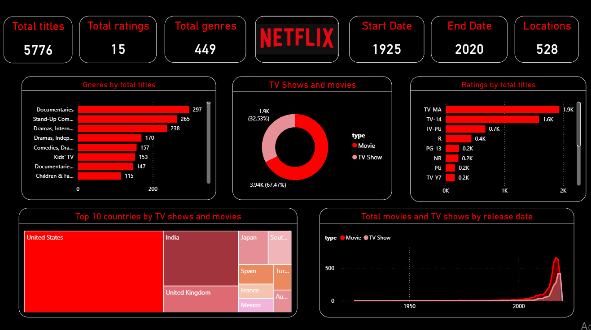

# netflix-powerbi-dashboard
# 🎬 Netflix Data Analytics Power BI Dashboard

An interactive, dark-themed Power BI dashboard analyzing Netflix's global content catalog (Movies & TV Shows). This project visualizes key metrics such as total titles, ratings breakdown, top genres, country distribution, and release trends over time.

---

## 📸 Dashboard Preview

---

## 📊 Key Insights & Highlights (From Visuals)

* **Catalog Size:** Analyzed **5,776 Total Titles** spanning across **528 Locations (Countries)** and **449 Unique Genres**.
* **Content Split (Donut Chart):** **Movies make up 67.47% (3.94K)** of the platform's content, while **TV Shows account for 32.53% (1.9K)**.
* **Top Genres:** **Documentaries (297)** and **Stand-Up Comedy (265)** emerge as the top distinct genres, followed closely by International Dramas.
* **Maturity Ratings:** **TV-MA (1.9K)** and **TV-14 (1.6K)** dominate the content offerings, showing a high concentration of mature audience material.
* **Geographical Distribution (Treemap):** **United States** leading content creation, followed by **India** and the **United Kingdom**.
* **Historical Release Trends:** Exponential surge in content additions between **2010 and 2020**.

---

## 🛠️ Tools & Skills Demonstrated

* **Business Intelligence Tool:** Power BI Desktop
* **Data Modeling & DAX:** KPI Cards, Time-Series Analysis, Custom Aggregations
* **Visualizations Used:** Donut Chart, Horizontal Bar Charts, Treemap, Area Chart, KPI Cards, Custom Filters/Slicers (Start & End Date: 1925 - 2020)
* **Design & UI:** Custom Dark Netflix Theme (Red & Black Contrast UI)

---

## 🚀 How to Run/View the Project

1. Clone or download this repository.
2. Open the `Netflix_Dashboard.pbix` file using **Power BI Desktop**.
3. Interact with visuals, filter by date ranges, or click categories for dynamic cross-filtering.
